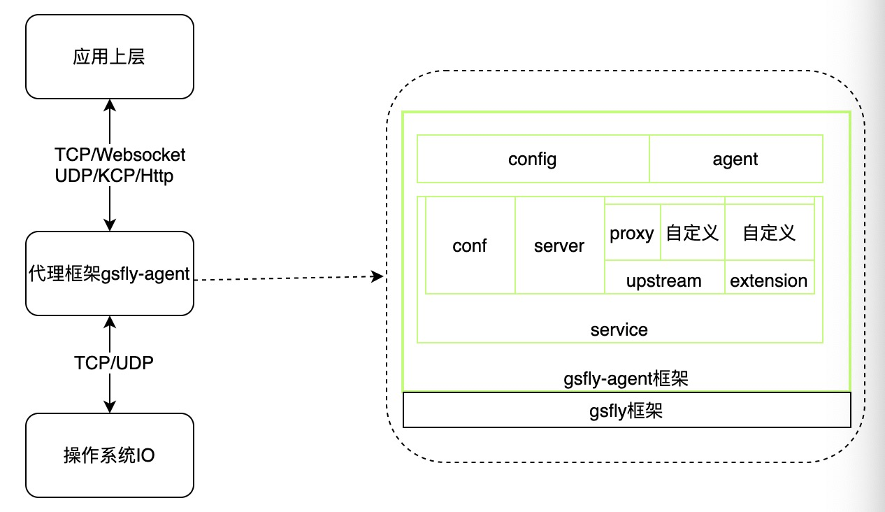
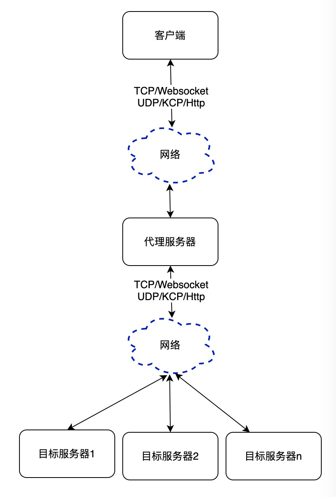

## gsfly-agent
### 功能介绍
1. **默认代理**  
**[gsfly-agent](https://github.com/Slive/gsfly-agent)** 是基于[gsfly](https://github.com/Slive/gsfly)，实现消息路由转发、协议转换等功能的代理服务，其中协议转换默认有如下：
    * websocket <--> websocket
    * websocket <--> kcp
    * kcp <--> kcp
    * kcp <--> websocket
    * http <--> http

2. **定制化代理**  
可定制化的实现方式，基于extension，upstream等的实现自定义路由转发，协议转换等功能

### 架构图

### 流程
主流程： 

### 快速入门

### 详细介绍

